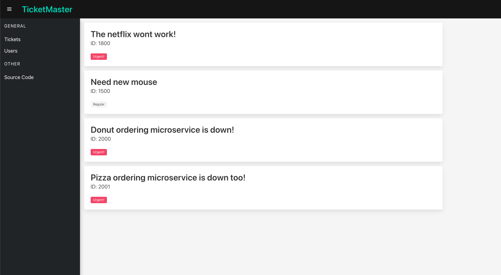
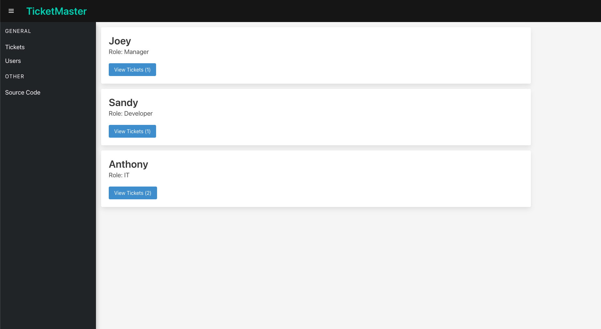
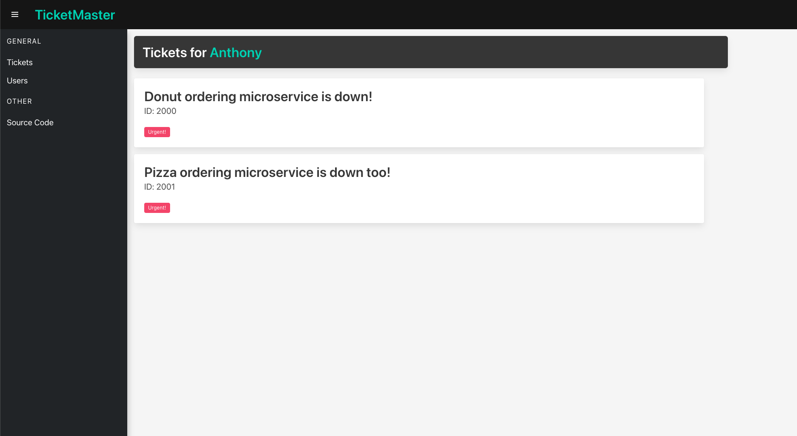

# Note: WIP 🏗️
# What is this?
- An example project involving two Go microservices and a front end consuming their data.
- Both of these microservices:
    - are built using [Go Gin](https://github.com/gin-gonic/gin)
    - communicate with each other
    - are deployed via K8s (Kubernetes)
    - share some fake data
- the front end (built in React) is also deployed using K8s.

## Visuals:

